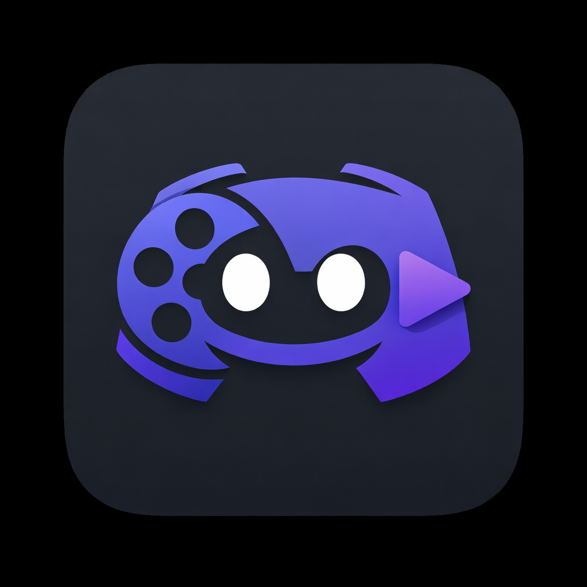

<p align="center">
  
</p>

# Discordarr

Discord bot for managing media requests through Overseerr, Sonarr, and Radarr. Users request movies and TV shows via slash commands, admins approve or deny with reasons, and everyone gets real-time download progress and notifications in Discord.

## Features

- **Media Requests** -- Search and request movies or TV shows directly from Discord. Requests from auto-approve users go straight through; others land in a channel for admin review.
- **Admin Workflow** -- Approve or deny requests from channel embeds. Deny with a reason via a modal popup. Requesters are pinged in threads and DM'd on status changes.
- **Real-Time Download Tracking** -- Embeds update every 15 seconds with download progress, size, ETA, and quality. Per-episode completion notifications in threads for TV shows.
- **Smart TV Status** -- Detects when all aired episodes of an in-progress series are downloaded and shows "Caught Up" instead of leaving it stuck at "Requested."
- **Dual-Source Request Polling** -- Picks up requests made through both Discord and the Overseerr web UI.
- **Library Browsing** -- Browse Sonarr/Radarr libraries, view upcoming calendars, and check download queues.
- **OAuth Linking** -- Users link their Discord account to Overseerr via `/link` for permission-aware requests.

## Commands

| Command | Description |
|---|---|
| `/request movie <search>` | Request a movie |
| `/request tv <search>` | Request a TV show |
| `/search <query>` | Search the library for existing media |
| `/status` | Check your request statuses |
| `/link` | Link your Discord account to Overseerr |
| `/sonarr queue` | View the Sonarr download queue |
| `/sonarr calendar [days]` | View upcoming episodes |
| `/sonarr library [search]` | Browse the series library |
| `/radarr queue` | View the Radarr download queue |
| `/radarr calendar [days]` | View upcoming movies |
| `/radarr library [search]` | Browse the movie library |

## Setup

### Prerequisites

- A Discord bot application with a token
- Overseerr, Sonarr, and Radarr instances with API keys

### Configuration

All configuration is via environment variables (validated with zod on startup). Create a `.env` file:

```env
DISCORD_TOKEN=
DISCORD_CLIENT_ID=
REQUEST_CHANNEL_ID=
OVERSEERR_URL=
OVERSEERR_API_KEY=
SONARR_URL=
SONARR_API_KEY=
RADARR_URL=
RADARR_API_KEY=
PUBLIC_URL=
```

| Variable | Required | Default | Description |
|---|---|---|---|
| `DISCORD_TOKEN` | Yes | | Discord bot token |
| `DISCORD_CLIENT_ID` | Yes | | Discord application client ID |
| `DISCORD_GUILD_ID` | No | | Restrict commands to a single guild (recommended for dev) |
| `REQUEST_CHANNEL_ID` | Yes | | Channel for request embeds |
| `MOVIE_CHANNEL_ID` | No | | Separate channel for movie requests (falls back to `REQUEST_CHANNEL_ID`) |
| `TV_CHANNEL_ID` | No | | Separate channel for TV requests (falls back to `REQUEST_CHANNEL_ID`) |
| `PENDING_CHANNEL_ID` | No | | Separate channel for unapproved requests (falls back to request channel) |
| `OVERSEERR_URL` | Yes | | Overseerr instance URL |
| `PUBLIC_OVERSEERR_URL` | No | | Public-facing Overseerr URL for redirects (falls back to `OVERSEERR_URL`) |
| `OVERSEERR_API_KEY` | Yes | | Overseerr API key |
| `SONARR_URL` | Yes | | Sonarr instance URL |
| `SONARR_API_KEY` | Yes | | Sonarr API key |
| `RADARR_URL` | Yes | | Radarr instance URL |
| `RADARR_API_KEY` | Yes | | Radarr API key |
| `PUBLIC_URL` | Yes | | Public URL for OAuth callbacks |
| `POLL_INTERVAL_SECONDS` | No | `15` | How often to poll download queues |
| `AVAILABILITY_CHECK_INTERVAL_SECONDS` | No | `120` | How often to check media availability |
| `MAX_SEARCH_RESULTS` | No | `25` | Max search results to show |
| `LOG_LEVEL` | No | `info` | Log level (fatal, error, warn, info, debug, trace) |

### Docker Compose (recommended)

```yaml
services:
  discordarr:
    image: ghcr.io/cryptiklemur/discordarr:latest
    # or build from source:
    # build: .
    restart: unless-stopped
    volumes:
      - discordarr-data:/app/data
    env_file: .env

volumes:
  discordarr-data:
```

```bash
docker compose up -d
```

The `/app/data` volume persists the SQLite database for request tracking.

### Docker

```bash
docker run -d \
  --name discordarr \
  -v discordarr-data:/app/data \
  --env-file .env \
  ghcr.io/cryptiklemur/discordarr:latest
```

### From Source

Requires [Bun](https://bun.sh).

```bash
bun install
bun run deploy-commands
bun run start
```

## Architecture

- **Runtime**: Bun
- **Language**: TypeScript (ESM)
- **Discord**: discord.js v14
- **Database**: SQLite via `bun:sqlite` (request tracking and pending approvals)
- **Logging**: pino

### Request Flow

1. User runs `/request movie` or `/request tv`
2. Bot searches Overseerr, shows results
3. User confirms -- bot replies "Movie Requested" / "Series Requested"
4. Poller picks up the request and posts a detailed embed in the request channel
5. For auto-approve users: request goes to Overseerr immediately, embed shows "Auto-Approved"
6. For others: request is stored locally as pending, embed shows Approve/Deny buttons
7. Admin approves or denies (with optional reason)
8. Download progress updates the embed in real-time
9. Per-episode completion messages appear in the thread
10. When fully available, the requester is notified via thread ping and DM

### Key Design Decisions

- **Deferred requests**: The Overseerr admin API key auto-approves everything. To support an approval workflow, non-auto-approve requests are stored in SQLite and only sent to Overseerr when an admin clicks Approve.
- **Polling over webhooks**: All status tracking is poll-based. Simpler to deploy (no public endpoints needed for Sonarr/Radarr), and the 15-second interval is responsive enough.
- **Overseerr as source of truth**: User permissions, request history, and media metadata come from Overseerr. The local SQLite DB only tracks Discord message IDs, pending approvals, and download state.

## License

MIT
